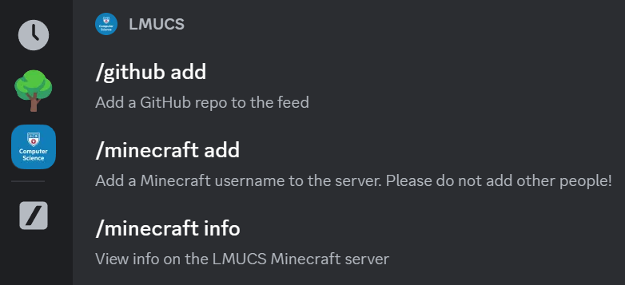

# Discord.js Typescript Template

- ⚙️ 100% Typescript (ESM)
- 🛠️ Slash Command & Event Handler
- 🧪 Unit Testing with Jest
- 🧹 ESLint + Prettier Config

## Getting Started

Start by creating a new repository on Github from this template. You can then clone the repo and install dependencies:

```bash
npm install -g yarn # install yarn (if not already installed)
yarn                # install dependencies
```

Create a bot application on the [Discord Developer Portal](https://discord.com/developers/applications) and add a bot user to it. Copy the bot token and client ID and add them to a `.env` file in the root of the project:

```bash
touch .env
echo "BOT_TOKEN=<your-bot-token>" >> .env
echo "CLIENT_ID=<your-client-id>" >> .env
```

After [adding the bot to a Discord server](https://discordjs.guide/preparations/adding-your-bot-to-servers.html#creating-and-using-your-invite-link), you can run the bot start script:

```bash
yarn dev # development mode (reloads on file changes)
yarn start # production mode (no reloads)
```

## Adding Slash Commands

To add a new slash command, create a new `.ts` file in the `src/commands` directory. The file should export a `Command` object. An example command from `src/commands/ping.ts` is shown below:

```ts
import { SlashCommandBuilder } from 'discord.js'
import { Command } from '../types/command'

const command: Command = {
  data: new SlashCommandBuilder().setName('ping').setDescription('Replies with Pong!'),
  execute: async interaction => await interaction.reply(`Pong!`),
}

export default command
```

The `Command` object has the following properties:

- `data` - The command data to be displayed on Discord, as shown:
  


- `execute` - The function to run when the command is invoked. This function recieves an `Interaction` object which must be aknowledged with a reply or deferred response.

To deploy all created commands to Discord, run the `deploy-commands` script:

```bash
yarn deploy-commands
```

You can also delete all commands from Discord with the `delete-commands` script:

```bash
yarn delete-commands
```

## Adding Event Listeners

Two events listeners are already set up in the template: `ready` and `interactionCreate`:

- `ready` - Triggered when the bot first comes online
- `interactionCreate` - Triggered when a user interacts with the bot via slash command, button, modal, etc.

You can add listeners for more events by creating a new `.ts` file in the `src/events` directory. The file should export an `Event` object. An example event from `src/events/ready.ts` is shown below:

```ts
import { Events } from 'discord.js'
import { createEvent } from '../types/event'

const event = createEvent({
  name: Events.ClientReady,
  once: true,
  execute: async client => {
    console.log(`Logged in as ${client.user?.tag}`)
  },
})

export default event
```

The `Event` object has the following properties:

- `name` - The name of the event to listen for (see [Discord.js docs](https://discord.js.org/#/docs/main/stable/class/Client))
- `once` - Whether the event should only be run once
- `execute` - The function to run when the event is triggered

Events are automatically registered when the bot starts, so there is no need to manually deploy them to Discord.

## Built-In Scripts

- `yarn dev` - Start the bot in development mode
- `yarn start` - Start the bot in production mode
- `yarn test` - Runs Jest unit tests
- `yarn lint` - Runs ESLint
- `yarn typecheck` - Runs Typescript type checking
- `yarn ci` - Runs all CI checks (lint, typecheck, test)
- `yarn deploy-commands` - Deploys slash commands to Discord
- `yarn delete-commands` - Deletes all slash commands from Discord
